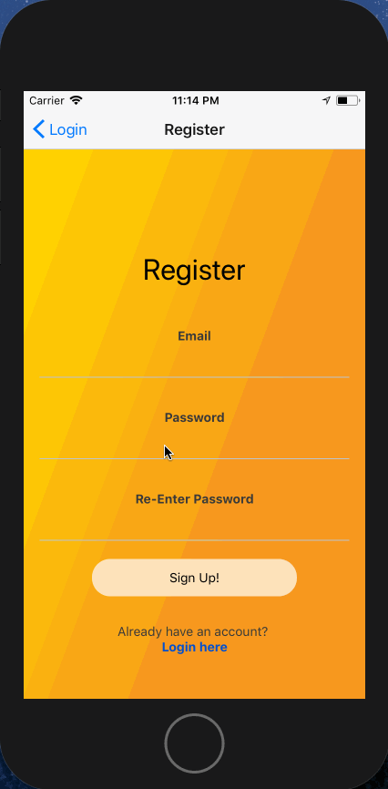

# Treats!

This app pairs with a node/express API managing a Mongo database found in my [treats-api-auth](https://github.com/eklemen/treats-api-auth) repo.

I know as a kid I didn't have a smartphone when I was trick or treating, but now kids have the power in their hands to trick or treat more effectively!

Treats! allows kids to pull up a map of their location and view houses in their area that others have been to. Each house has a net score and up/down vote buttons to spread the word about which house has the good n' plenty and which houses are real milk duds.

### Login and Vote

### Create new account
